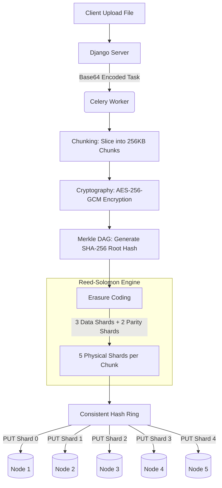

# Tech Stack & Architecture

AetherStore is a hybrid-decentralized object storage system designed to replace traditional centralized storage buckets (like AWS S3) with a cryptographically secure, resilient Peer-to-Peer architecture.

## Technology Stack

- **Framework**: Django REST Framework (DRF)
- **Task Queue**: Celery with Redis broker
- **P2P Node Server**: `aiohttp` (Asynchronous Python)
- **Cryptography**: `cryptography` library (AES-256-GCM)
- **Hashing**: SHA-256
- **Erasure Coding**: `reedsolo` (Reed-Solomon Error Correction)

## Physical Storage Mechanism

AetherStore does not store exact copies of your uploaded file blobs. Instead, it relies on a multi-stage data processing pipeline.

### The Pipeline Visualization

### 1. Chunking
Files are broken down into **256KB chunks**. This parallelizes downloads and enables efficient deduplication. If you change one byte of a 10GB file, only a single 256KB chunk must be re-uploaded.

### 2. Encryption
Each 256KB chunk is individually encrypted via **AES-256-GCM** using a key derived from the owner's DID and salt. Every chunk receives a unique secure Random `Nonce` and an `Auth Tag`. Nodes store pure ciphertext; they mathematically cannot decrypt what they hold.

### 3. Merkle DAG (Directed Acyclic Graph)
Each encrypted chunk is SHA-256 hashed. The hashes form the lowest leaves of a tree, pairing and hashing upwards until a single **Root Hash** represents the entire file structure. This cryptographic seal instantly catches node tampering or bit-rot.

### 4. Erasure Coding (Reed-Solomon)
To defend against network node failure, every 256KB chunk is expanded into **5 Mathematical Shards** (3 Data `+` 2 Parity). 
You only ever need **ANY 3** of these shards to math-repair and perfectly reassemble the original 256KB chunk!

### 5. Consistent Hash Ring
A `Consistent Hash Ring` takes the Root Hash of the node and systematically isolates exactly 5 physically unique Storage Endpoints on the network. The 5 Erasure Shards for the chunks are sequentially dealt out across these 5 distinct machines like cards to guarantee isolated physical redundancy.
